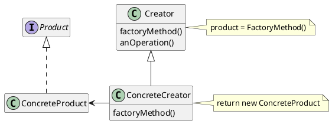

# Teste

<figure>

```plantuml
@startuml
interface Product{
}


class ConcreteProduct{
}


class Creator{
    factoryMethod()
    anOperation()
}


class ConcreteCreator{
    factoryMethod()
}


Product <|.. ConcreteProduct
ConcreteProduct <- ConcreteCreator
Creator <|-- ConcreteCreator


class Creator
note right: product = FactoryMethod()
class ConcreteCreator
note right: return new ConcreteProduct


hide empty attributes
hide empty methods


@enduml
```

<figcaption>Estrutura Factory Method.</figcaption>
</figure>

@import "src/java/ClasseA.java"